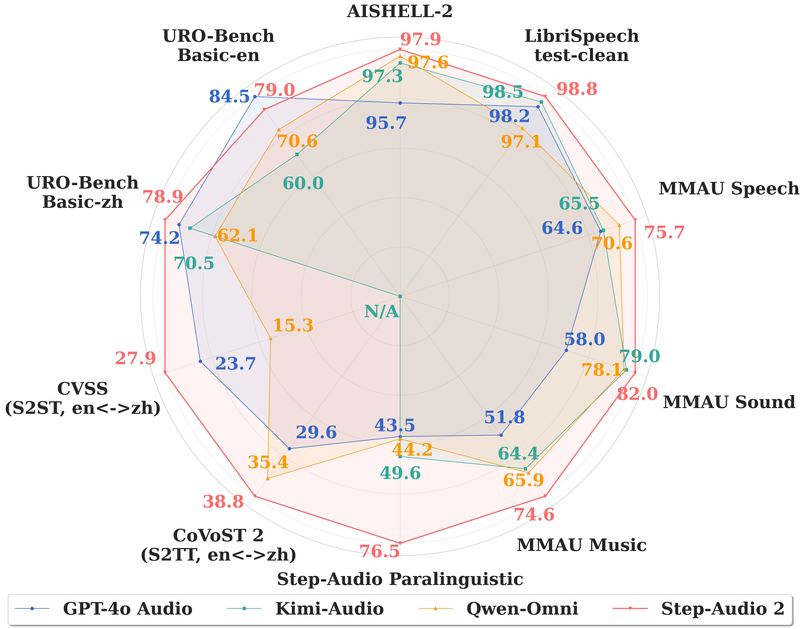

# Step-Audio 2

<div align="center">
  
</div>

<div align="center">
  <a href="https://arxiv.org/abs/2507.16632"></a> &ensp;
  <a href="https://x.com/StepFun_ai"></a> &ensp;
</div>

## 🔥🔥🔥 News!!
* Jul 24, 2025: 👋 We release [demonstration videos for Step-Audio 2](https://www.stepfun.com/docs/step-audio2).
* Jul 23, 2025: 👋 We release our benchmark for paralinguistic information understanding, [StepEval-Audio-Paralinguistic](https://huggingface.co/datasets/stepfun-ai/StepEval-Audio-Paralinguistic).
* Jul 23, 2025: 👋 We release our benchmark for tool calling, [StepEval-Audio-Toolcall](https://huggingface.co/datasets/stepfun-ai/StepEval-Audio-Toolcall).
* Jul 23, 2025: 👋 We release the technical report of [Step-Audio 2](https://arxiv.org/pdf/2507.16632).

<div align="center">
  
</div>

## Introduction


Step-Audio 2 is an end-to-end multi-modal large language model designed for industry-strength audio understanding and speech conversation.

- **Advanced Speech and Audio Understanding**: Promising performance in ASR and audio understanding by comprehending and reasoning semantic information, para-linguistic and non-vocal information.

- **Intelligent Speech Conversation**: Achieving natural and intelligent interactions that are contextually appropriate for various conversational scenarios and paralinguistic information.

- **Tool Calling and Multimodal RAG**: By leveraging tool calling and RAG to access real-world knowledge (both textual and acoustic), Step-Audio 2 can generate responses with fewer hallucinations for diverse scenarios, while also having the ability to switch timbres based on retrieved speech.

- **State-of-the-Art Performance**: Achieving state-of-the-art performance on various audio understanding and conversational benchmarks compared to other open-source and commercial solutions. (See [Evaluation](#evaluation) and [Technical Report](https://arxiv.org/pdf/2507.16632)).

+ **License**: The repository is licensed under the [Apache 2.0](LICENSE) License.


## Evaluation
<div align="center">
  
</div>

### Automatic speech recognition
CER for Chinese, Cantonese and Japanese and WER for Arabian and English. N/A indicates that the language is not supported.

<table border="1" cellpadding="5" cellspacing="0" align="center">
  <thead>
    <tr>
      <th style="text-align: center;">Category</th>
      <th style="text-align: center;">Test set</th>
      <th style="text-align: center;">Doubao LLM ASR</th>
      <th style="text-align: center;">GPT-4o Transcribe</th>
      <th style="text-align: center;">Kimi-Audio</th>
      <th style="text-align: center;">Qwen-Omni</th>
      <th style="text-align: center;">Step-Audio 2</th>
    </tr>
  </thead>
  <tbody>
    <tr>
      <td rowspan="5" style="text-align: center; vertical-align: middle;"><strong>English</strong></td>
      <td align="left">Common Voice</td>
      <td align="center">9.20</td>
      <td align="center">9.30</td>
      <td align="center">7.83</td>
      <td align="center">8.33</td>
      <td align="center"><strong>5.98</strong></td>
    </tr>
    <tr>
      <td align="left">FLEURS English</td>
      <td align="center">7.22</td>
      <td align="center"><strong>2.71</strong></td>
      <td align="center">4.47</td>
      <td align="center">5.05</td>
      <td align="center">3.05</td>
    </tr>
    <tr>
      <td align="left">LibriSpeech clean</td>
      <td align="center">2.92</td>
      <td align="center">1.75</td>
      <td align="center">1.49</td>
      <td align="center">2.93</td>
      <td align="center"><strong>1.19</strong></td>
    </tr>
    <tr>
      <td align="left">LibriSpeech other</td>
      <td align="center">5.32</td>
      <td align="center">4.23</td>
      <td align="center">2.91</td>
      <td align="center">5.07</td>
      <td align="center"><strong>2.49</strong></td>
    </tr>
    <tr>
      <td align="left"><strong>Average</strong></td>
      <td align="center">6.17</td>
      <td align="center">4.50</td>
      <td align="center">4.18</td>
      <td align="center">5.35</td>
      <td align="center"><strong>3.18</strong></td>
    </tr>
    <tr>
      <td rowspan="7" style="text-align: center; vertical-align: middle;"><strong>Chinese</strong></td>
      <td align="left">AISHELL</td>
      <td align="center">0.98</td>
      <td align="center">3.52</td>
      <td align="center"><strong>0.64</strong></td>
      <td align="center">1.17</td>
      <td align="center">0.65</td>
    </tr>
    <tr>
      <td align="left">AISHELL-2</td>
      <td align="center">3.10</td>
      <td align="center">4.26</td>
      <td align="center">2.67</td>
      <td align="center">2.40</td>
      <td align="center"><strong>2.13</strong></td>
    </tr>
    <tr>
      <td align="left">FLEURS Chinese</td>
      <td align="center">2.92</td>
      <td align="center"><strong>2.62</strong></td>
      <td align="center">2.91</td>
      <td align="center">7.01</td>
      <td align="center">2.80</td>
    </tr>
    <tr>
      <td align="left">KeSpeech phase1</td>
      <td align="center">6.48</td>
      <td align="center">26.80</td>
      <td align="center">5.11</td>
      <td align="center">6.45</td>
      <td align="center"><strong>3.62</strong></td>
    </tr>
    <tr>
      <td align="left">WenetSpeech meeting</td>
      <td align="center">4.90</td>
      <td align="center">31.40</td>
      <td align="center">5.21</td>
      <td align="center">6.61</td>
      <td align="center"><strong>4.73</strong></td>
    </tr>
    <tr>
      <td align="left">WenetSpeech net</td>
      <td align="center"><strong>4.46</strong></td>
      <td align="center">15.71</td>
      <td align="center">5.93</td>
      <td align="center">5.24</td>
      <td align="center">4.74</td>
    </tr>
    <tr>
      <td align="left"><strong>Average</strong></td>
      <td align="center">3.81</td>
      <td align="center">14.05</td>
      <td align="center">3.75</td>
      <td align="center">4.81</td>
      <td align="center"><strong>3.11</strong></td>
    </tr>
    <tr>
      <td rowspan="3" style="text-align: center; vertical-align: middle;"><strong>Multilingual </strong></td>
      <td align="left">FLEURS Arabian</td>
      <td align="center">N/A</td>
      <td align="center"><strong>11.72</strong></td>
      <td align="center">N/A</td>
      <td align="center">25.13</td>
      <td align="center">15.66</td>
    </tr>
    <tr>
      <td align="left">Common Voice yue</td>
      <td align="center">9.20</td>
      <td align="center">11.10</td>
      <td align="center">38.90</td>
      <td align="center"><strong>7.89</strong></td>
      <td align="center">8.04</td>
    </tr>
    <tr>
      <td align="left">FLEURS Japanese</td>
      <td align="center">N/A</td>
      <td align="center"><strong>3.27</strong></td>
      <td align="center">N/A</td>
      <td align="center">10.49</td>
      <td align="center">3.44</td>
    </tr>
    <tr>
      <td rowspan="7" style="text-align: center; vertical-align: middle;"><strong>In-house</strong></td>
      <td align="left">Anhui accent</td>
      <td align="center"><strong>8.83</strong></td>
      <td align="center">50.55</td>
      <td align="center">22.17</td>
      <td align="center">18.73</td>
      <td align="center">10.99</td>
    </tr>
    <tr>
      <td align="left">Guangdong accent</td>
      <td align="center">4.99</td>
      <td align="center">7.83</td>
      <td align="center"><strong>3.76</strong></td>
      <td align="center">4.03</td>
      <td align="center">3.87</td>
    </tr>
    <tr>
      <td align="left">Guangxi accent</td>
      <td align="center">3.37</td>
      <td align="center">7.09</td>
      <td align="center">4.29</td>
      <td align="center"><strong>3.35</strong></td>
      <td align="center">4.08</td>
    </tr>
    <tr>
      <td align="left">Shanxi accent</td>
      <td align="center">20.26</td>
      <td align="center">55.03</td>
      <td align="center">34.71</td>
      <td align="center">25.95</td>
      <td align="center"><strong>13.77</strong></td>
    </tr>
    <tr>
      <td align="left">Sichuan dialect</td>
      <td align="center"><strong>3.01</strong></td>
      <td align="center">32.85</td>
      <td align="center">5.26</td>
      <td align="center">5.61</td>
      <td align="center">4.28</td>
    </tr>
    <tr>
      <td align="left">Shanghai dialect</td>
      <td align="center">47.49</td>
      <td align="center">89.58</td>
      <td align="center">82.90</td>
      <td align="center">58.74</td>
      <td align="center"><strong>18.14</strong></td>
    </tr>
    <tr>
      <td align="left"><strong>Average</strong></td>
      <td align="center">14.66</td>
      <td align="center">40.49</td>
      <td align="center">25.52</td>
      <td align="center">19.40</td>
      <td align="center"><strong>9.19</strong></td>
    </tr>
  </tbody>
</table>

### Paralinguistic information understanding
StepEval-Audio-Paralinguistic
<table border="1" cellpadding="5" cellspacing="0" align="center">
  <thead>
    <tr>
      <th style="text-align: center;" rowspan="2">Model</th>
      <th style="text-align: center;" rowspan="2">Avg.</th>
      <th style="text-align: center;" rowspan="2">Gender</th>
      <th style="text-align: center;" rowspan="2">Age</th>
      <th style="text-align: center;" rowspan="2">Timbre</th>
      <th style="text-align: center;" rowspan="2">Scenario</th>
      <th style="text-align: center;" rowspan="2">Event</th>
      <th style="text-align: center;" rowspan="2">Emotion</th>
      <th style="text-align: center;" rowspan="2">Pitch</th>
      <th style="text-align: center;" rowspan="2">Rhythm</th>
      <th style="text-align: center;" rowspan="2">Speed</th>
      <th style="text-align: center;" rowspan="2">Style</th>
      <th style="text-align: center;" rowspan="2">Vocal</th>
    </tr>
  </thead>
  <tbody>
    <tr>
      <td align="left"><strong>GPT-4o Audio</strong></td>
      <td align="center">43.45</td>
      <td align="center">18</td>
      <td align="center">42</td>
      <td align="center">34</td>
      <td align="center">22</td>
      <td align="center">14</td>
      <td align="center"><strong>82</strong></td>
      <td align="center">40</td>
      <td align="center">60</td>
      <td align="center">58</td>
      <td align="center">64</td>
      <td align="center">44</td>
    </tr>
    <tr>
      <td align="left"><strong>Kimi-Audio</strong></td>
      <td align="center">49.64</td>
      <td align="center">94</td>
      <td align="center">50</td>
      <td align="center">10</td>
      <td align="center">30</td>
      <td align="center"><strong>48</strong></td>
      <td align="center">66</td>
      <td align="center">56</td>
      <td align="center">40</td>
      <td align="center">44</td>
      <td align="center">54</td>
      <td align="center">54</td>
    </tr>
    <tr>
      <td align="left"><strong>Qwen-Omni</strong></td>
      <td align="center">44.18</td>
      <td align="center">40</td>
      <td align="center">50</td>
      <td align="center">16</td>
      <td align="center">28</td>
      <td align="center">42</td>
      <td align="center">76</td>
      <td align="center">32</td>
      <td align="center">54</td>
      <td align="center">50</td>
      <td align="center">50</td>
      <td align="center">48</td>
    </tr>
    <tr>
      <td align="left"><strong>Step-Audio-AQAA</strong></td>
      <td align="center">36.91</td>
      <td align="center">70</td>
      <td align="center">66</td>
      <td align="center">18</td>
      <td align="center">14</td>
      <td align="center">14</td>
      <td align="center">40</td>
      <td align="center">38</td>
      <td align="center">48</td>
      <td align="center">54</td>
      <td align="center">44</td>
      <td align="center">0</td>
    </tr>
    <tr>
      <td align="left"><strong>Step-Audio 2</strong></td>
      <td align="center"><strong>76.55</strong></td>
      <td align="center"><strong>98</strong></td>
      <td align="center"><strong>92</strong></td>
      <td align="center"><strong>78</strong></td>
      <td align="center"><strong>64</strong></td>
      <td align="center">46</td>
      <td align="center">72</td>
      <td align="center"><strong>78</strong></td>
      <td align="center"><strong>70</strong></td>
      <td align="center"><strong>78</strong></td>
      <td align="center"><strong>84</strong></td>
      <td align="center"><strong>82</strong></td>
    </tr>
  </tbody>
</table>

### Audio understanding and reasoning
MMAU
<table border="1" cellpadding="5" cellspacing="0" align="center">
  <thead>
    <tr>
      <th style="text-align: center;">Model</th>
      <th style="text-align: center;">Avg.</th>
      <th style="text-align: center;">Sound</th>
      <th style="text-align: center;">Speech</th>
      <th style="text-align: center;">Music</th>
    </tr>
  </thead>
  <tbody>
    <tr>
      <td align="left"><strong>Audio Flamingo 3</strong></td>
      <td align="center">73.1</td>
      <td align="center">76.9</td>
      <td align="center">66.1</td>
      <td align="center">73.9</td>
    </tr>
    <tr>
      <td align="left"><strong>Gemini 2.5 Flash</strong></td>
      <td align="center">63.4</td>
      <td align="center">64.0</td>
      <td align="center">68.2</td>
      <td align="center">58.1</td>
    </tr>
    <tr>
      <td align="left"><strong>GPT-4o Audio</strong></td>
      <td align="center">58.1</td>
      <td align="center">58.0</td>
      <td align="center">64.6</td>
      <td align="center">51.8</td>
    </tr>
    <tr>
      <td align="left"><strong>Kimi-Audio</strong></td>
      <td align="center">69.6</td>
      <td align="center">79.0</td>
      <td align="center">65.5</td>
      <td align="center">64.4</td>
    </tr>
    <tr>
      <td align="left"><strong>Omni-R1</strong></td>
      <td align="center">77.0</td>
      <td align="center">81.7</td>
      <td align="center"><strong>76.0</strong></td>
      <td align="center">73.4</td>
    </tr>
    <tr>
      <td align="left"><strong>Qwen2.5-Omni</strong></td>
      <td align="center">71.5</td>
      <td align="center">78.1</td>
      <td align="center">70.6</td>
      <td align="center">65.9</td>
    </tr>
    <tr>
      <td align="left"><strong>Step-Audio-AQAA</strong></td>
      <td align="center">49.7</td>
      <td align="center">50.5</td>
      <td align="center">51.4</td>
      <td align="center">47.3</td>
    </tr>
    <tr>
      <td align="left"><strong>Step-Audio 2</strong></td>
      <td align="center"><strong>77.4</strong></td>
      <td align="center"><strong>82.0</strong></td>
      <td align="center">75.7</td>
      <td align="center"><strong>74.6</strong></td>
    </tr>
  </tbody>
</table>

### Speech translation

<table border="1" cellpadding="5" cellspacing="0" align="center">
  <thead>
    <tr>
      <th style="text-align: center;" rowspan="2">Model</th>
      <th style="text-align: center;" colspan="3">CoVoST 2 (S2TT)</th>
    </tr>
    <tr>
      <th>Avg.</th>
      <th>English-to-Chinese</th>
      <th>Chinese-to-English</th>
    </tr>
  </thead>
  <tbody>
    <tr>
      <td align="left"><strong>GPT-4o Audio</strong></td>
      <td align="center">29.61</td>
      <td align="center">40.20</td>
      <td align="center">19.01</td>
    </tr>
    <tr>
      <td align="left"><strong>Qwen2.5-Omni</strong></td>
      <td align="center">35.40</td>
      <td align="center">41.40</td>
      <td align="center"><strong>29.40</strong></td>
    </tr>
    <tr>
      <td align="left"><strong>Step-Audio-AQAA</strong></td>
      <td align="center">28.57</td>
      <td align="center">37.71</td>
      <td align="center">19.43</td>
    </tr>
    <tr>
      <td align="left"><strong>Step-Audio 2</strong></td>
      <td align="center"><strong>38.84</strong></td>
      <td align="center"><strong>48.40</strong></td>
      <td align="center">29.27</td>
    </tr>
  </tbody>
</table>

<table border="1" cellpadding="5" cellspacing="0" align="center">
  <thead>
    <tr>
      <th style="text-align: center;" rowspan="2">Model</th>
      <th style="text-align: center;" colspan="3">CVSS (S2ST)</th>
    </tr>
    <tr>
      <th>Avg.</th>
      <th>English-to-Chinese</th>
      <th>Chinese-to-English</th>
    </tr>
  </thead>
  <tbody>
    <tr>
      <td align="left"><strong>GPT-4o Audio</strong></td>
      <td align="center">23.68</td>
      <td align="center">20.07</td>
      <td align="center"><strong>27.29</strong></td>
    </tr>
    <tr>
      <td align="left"><strong>Qwen-Omni</strong></td>
      <td align="center">15.35</td>
      <td align="center">8.04</td>
      <td align="center">22.66</td>
    </tr>
    <tr>
      <td align="left"><strong>Step-Audio-AQAA</strong></td>
      <td align="center">27.36</td>
      <td align="center">30.74</td>
      <td align="center">23.98</td>
    </tr>
    <tr>
      <td align="left"><strong>Step-Audio 2</strong></td>
      <td align="center"><strong>27.86</strong></td>
      <td align="center"><strong>32.86</strong></td>
      <td align="center">22.85</td>
    </tr>
  </tbody>
</table>

### Tool calling
StepEval-Audio-Toolcall. Date and time tools have no parameter.
<table border="1" cellpadding="5" cellspacing="0" align="center">
  <thead>
    <tr>
      <th style="text-align: center;">Model</th>
      <th style="text-align: center;">Objective</th>
      <th style="text-align: center;">Metric</th>
      <th style="text-align: center;">Audio search</th>
      <th style="text-align: center;">Date & Time</th>
      <th style="text-align: center;">Weather</th>
      <th style="text-align: center;">Web search</th>
    </tr>
  </thead>
  <tbody>
    <tr>
      <td style="text-align: center; vertical-align: middle;" rowspan="3"><strong>Qwen3-32B</strong><sup>†</sup></td>
      <td align="center"><strong>Trigger</strong></td>
      <td align="center"><strong>Precision / Recall</strong></td>
      <td align="center">67.5 / 98.5</td>
      <td align="center">98.4 / 100.0</td>
      <td align="center">90.1 / 100.0</td>
      <td align="center">86.8 / 98.5</td>
    </tr>
    <tr>
      <td align="center"><strong>Type</strong></td>
      <td align="center"><strong>Accuracy</strong></td>
      <td align="center">100.0</td>
      <td align="center">100.0</td>
      <td align="center">98.5</td>
      <td align="center">98.5</td>
    </tr>
    <tr>
      <td align="center"><strong>Parameter</strong></td>
      <td align="center"><strong>Accuracy</strong></td>
      <td align="center">100.0</td>
      <td align="center">N/A</td>
      <td align="center">100.0</td>
      <td align="center">100.0</td>
    </tr>
    <tr>
      <td style="text-align: center; vertical-align: middle;" rowspan="3"><strong>Step-Audio 2</strong></td>
      <td align="center"><strong>Trigger</strong></td>
      <td align="center"><strong>Precision / Recall</strong></td>
      <td align="center">86.8 / 99.5</td>
      <td align="center">96.9 / 98.4</td>
      <td align="center">92.2 / 100.0</td>
      <td align="center">88.4 / 95.5</td>
    </tr>
    <tr>
      <td align="center"><strong>Type</strong></td>
      <td align="center"><strong>Accuracy</strong></td>
      <td align="center">100.0</td>
      <td align="center">100.0</td>
      <td align="center">90.5</td>
      <td align="center">98.4</td>
    </tr>
    <tr>
      <td align="center"><strong>Parameter</strong></td>
      <td align="center"><strong>Accuracy</strong></td>
      <td align="center">100.0</td>
      <td align="center">N/A</td>
      <td align="center">100.0</td>
      <td align="center">100.0</td>
    </tr>
  </tbody>
</table>

### Speech-to-speech conversation
URO-Bench. U. R. O. stands for understanding, reasoning, and oral conversation, respectively.
<table border="1" cellpadding="5" cellspacing="0" align="center">
  <thead>
    <tr>
      <th style="text-align: center;" rowspan="2">Model</th>
      <th style="text-align: center;" rowspan="2">Language</th>
      <th style="text-align: center;" colspan="4">Basic</th>
      <th style="text-align: center;" colspan="4">Pro</th>
    </tr>
    <tr>
      <th style="text-align: center;">Avg.</th>
      <th style="text-align: center;">U.</th>
      <th style="text-align: center;">R.</th>
      <th style="text-align: center;">O.</th>
      <th style="text-align: center;">Avg.</th>
      <th style="text-align: center;">U.</th>
      <th style="text-align: center;">R.</th>
      <th style="text-align: center;">O.</th>
    </tr>
  </thead>
  <tbody>
    <tr>
      <td align="left"><strong>GPT-4o Audio</strong></td>
      <td rowspan="5" style="text-align: center; vertical-align: middle;"><strong>Chinese</strong></td>
      <td align="center">74.18</td>
      <td align="center">82.98</td>
      <td align="center">57.23</td>
      <td align="center"><strong>82.33</strong></td>
      <td align="center">66.91</td>
      <td align="center">72.94</td>
      <td align="center">51.52</td>
      <td align="center">71.14</td>
    </tr>
    <tr>
      <td align="left"><strong>Kimi-Audio</strong></td>
      <td align="center">70.47</td>
      <td align="center">75.86</td>
      <td align="center">59.69</td>
      <td align="center">75.85</td>
      <td align="center">66.21</td>
      <td align="center">63.13</td>
      <td align="center">55.09</td>
      <td align="center"><strong>76.70</strong></td>
    </tr>
    <tr>
      <td align="left"><strong>Qwen-Omni</strong></td>
      <td align="center">62.08</td>
      <td align="center">46.44</td>
      <td align="center">64.73</td>
      <td align="center">75.05</td>
      <td align="center">61.06</td>
      <td align="center">61.55</td>
      <td align="center">59.79</td>
      <td align="center">61.43</td>
    </tr>
    <tr>
      <td align="left"><strong>Step-Audio-AQAA</strong></td>
      <td align="center">55.73</td>
      <td align="center">66.02</td>
      <td align="center">57.31</td>
      <td align="center">43.87</td>
      <td align="center">59.15</td>
      <td align="center">61.82</td>
      <td align="center">52.74</td>
      <td align="center">60.74</td>
    </tr>
    <tr>
      <td align="left"><strong>Step-Audio 2</strong></td>
      <td align="center"><strong>78.86</strong></td>
      <td align="center"><strong>87.66</strong></td>
      <td align="center"><strong>68.52</strong></td>
      <td align="center">80.39</td>
      <td align="center"><strong>70.83</strong></td>
      <td align="center"><strong>79.35</strong></td>
      <td align="center"><strong>59.71</strong></td>
      <td align="center">69.72</td>
    </tr>
    <tr>
      <td align="left"><strong>GPT-4o Audio</strong></td>
      <td rowspan="5" style="text-align: center; vertical-align: middle;"><strong>English</strong></td>
      <td align="center"><strong>84.54</strong></td>
      <td align="center">90.18</td>
      <td align="center"><strong>75.90</strong></td>
      <td align="center"><strong>90.41</strong></td>
      <td align="center"><strong>67.51</strong></td>
      <td align="center"><strong>60.65</strong></td>
      <td align="center"><strong>64.36</strong></td>
      <td align="center"><strong>78.46</strong></td>
    </tr>
    <tr>
      <td align="left"><strong>Kimi-Audio</strong></td>
      <td align="center">60.04</td>
      <td align="center">83.36</td>
      <td align="center">42.31</td>
      <td align="center">60.36</td>
      <td align="center">49.79</td>
      <td align="center">50.32</td>
      <td align="center">40.59</td>
      <td align="center">56.04</td>
    </tr>
    <tr>
      <td align="left"><strong>Qwen-Omni</strong></td>
      <td align="center">70.58</td>
      <td align="center">66.29</td>
      <td align="center">69.62</td>
      <td align="center">76.16</td>
      <td align="center">50.99</td>
      <td align="center">44.51</td>
      <td align="center">63.88</td>
      <td align="center">49.41</td>
    </tr>
    <tr>
      <td align="left"><strong>Step-Audio-AQAA</strong></td>
      <td align="center">71.11</td>
      <td align="center">90.15</td>
      <td align="center">56.12</td>
      <td align="center">72.06</td>
      <td align="center">52.01</td>
      <td align="center">44.25</td>
      <td align="center">54.54</td>
      <td align="center">59.81</td>
    </tr>
    <tr>
      <td align="left"><strong>Step-Audio 2</strong></td>
      <td align="center">79.03</td>
      <td align="center"><strong>90.80</strong></td>
      <td align="center">70.42</td>
      <td align="center">78.74</td>
      <td align="center">60.25</td>
      <td align="center">60.47</td>
      <td align="center">61.21</td>
      <td align="center">59.25</td>
    </tr>
  </tbody>
</table>


## Citation

```
@misc{wu2025stepaudio2technicalreport,
      title={Step-Audio 2 Technical Report},
      author={Boyong Wu and Chao Yan and Chen Hu and Cheng Yi and Chengli Feng and Fei Tian and Feiyu Shen and Gang Yu and Haoyang Zhang and Jingbei Li and Mingrui Chen and Peng Liu and Wang You and Xiangyu Tony Zhang and Xingyuan Li and Xuerui Yang and Yayue Deng and Yechang Huang and Yuxin Li and Yuxin Zhang and Zhao You and Brian Li and Changyi Wan and Hanpeng Hu and Jiangjie Zhen and Siyu Chen and Song Yuan and Xuelin Zhang and Yimin Jiang and Yu Zhou and Yuxiang Yang and Bingxin Li and Buyun Ma and Changhe Song and Dongqing Pang and Guoqiang Hu and Haiyang Sun and Kang An and Na Wang and Shuli Gao and Wei Ji and Wen Li and Wen Sun and Xuan Wen and Yong Ren and Yuankai Ma and Yufan Lu and Bin Wang and Bo Li and Changxin Miao and Che Liu and Chen Xu and Dapeng Shi and Dingyuan Hu and Donghang Wu and Enle Liu and Guanzhe Huang and Gulin Yan and Han Zhang and Hao Nie and Haonan Jia and Hongyu Zhou and Jianjian Sun and Jiaoren Wu and Jie Wu and Jie Yang and Jin Yang and Junzhe Lin and Kaixiang Li and Lei Yang and Liying Shi and Li Zhou and Longlong Gu and Ming Li and Mingliang Li and Mingxiao Li and Nan Wu and Qi Han and Qinyuan Tan and Shaoliang Pang and Shengjie Fan and Siqi Liu and Tiancheng Cao and Wanying Lu and Wenqing He and Wuxun Xie and Xu Zhao and Xueqi Li and Yanbo Yu and Yang Yang and Yi Liu and Yifan Lu and Yilei Wang and Yuanhao Ding and Yuanwei Liang and Yuanwei Lu and Yuchu Luo and Yuhe Yin and Yumeng Zhan and Yuxiang Zhang and Zidong Yang and Zixin Zhang and Binxing Jiao and Daxin Jiang and Heung-Yeung Shum and Jiansheng Chen and Jing Li and Xiangyu Zhang and Yibo Zhu},
      year={2025},
      eprint={2507.16632},
      archivePrefix={arXiv},
      primaryClass={cs.CL},
      url={https://arxiv.org/abs/2507.16632},
}
```

## Star History

[](https://star-history.com/#stepfun-ai/Step-Audio2&Date)
